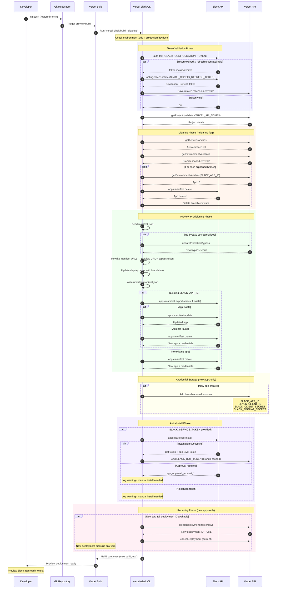

# @vercel/slack-bolt Preview Deployment Sequence Diagram

## Flow Summary

### 1. Token Validation
- Validates `SLACK_CONFIGURATION_TOKEN` via `auth.test`
- Auto-rotates expired tokens if `SLACK_CONFIG_REFRESH_TOKEN` is available

### 2. Cleanup (optional)
- Identifies orphaned preview branches (no longer active in Vercel)
- Deletes associated Slack apps via `apps.manifest.delete`
- Removes branch-scoped environment variables

### 3. Preview Provisioning
- Generates bypass secret for Vercel deployment protection
- Rewrites manifest URLs to point to preview deployment
- Creates or updates Slack app via manifest API

### 4. Credential Storage
- Stores app credentials as branch-scoped env vars:
  - `SLACK_APP_ID`
  - `SLACK_CLIENT_ID`
  - `SLACK_CLIENT_SECRET`
  - `SLACK_SIGNING_SECRET`

### 5. Auto-Install
- If `SLACK_SERVICE_TOKEN` is provided, auto-installs the app
- Stores `SLACK_BOT_TOKEN` as branch-scoped env var

### 6. Redeploy
- For new apps, triggers a redeploy to pick up new env vars
- Cancels the current deployment to avoid duplicate builds
